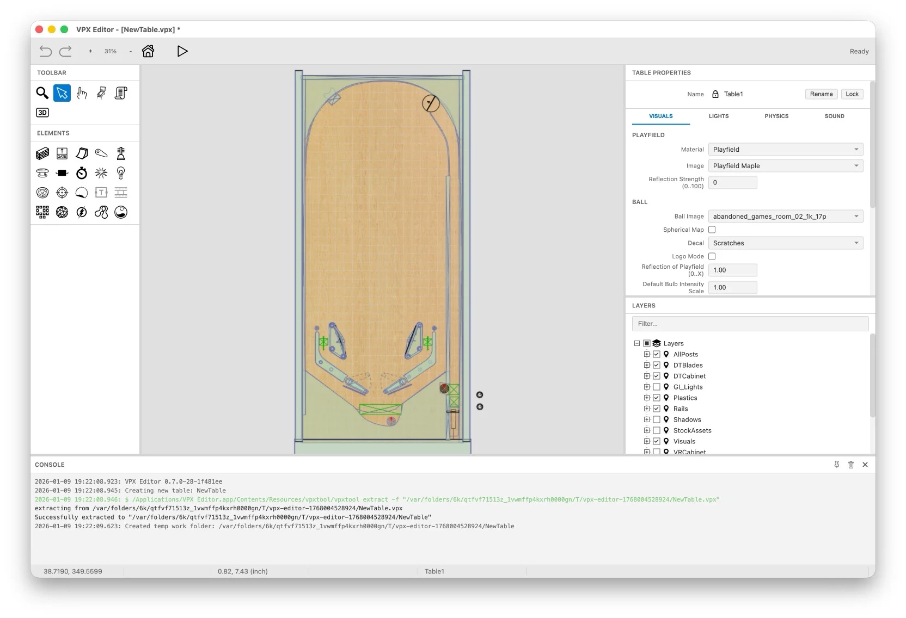
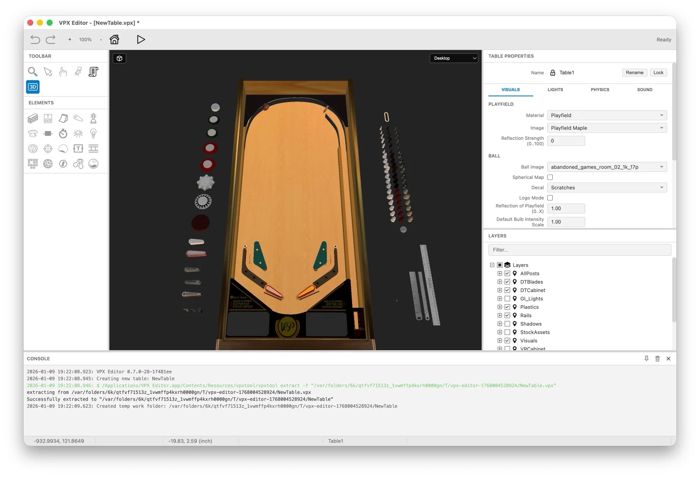
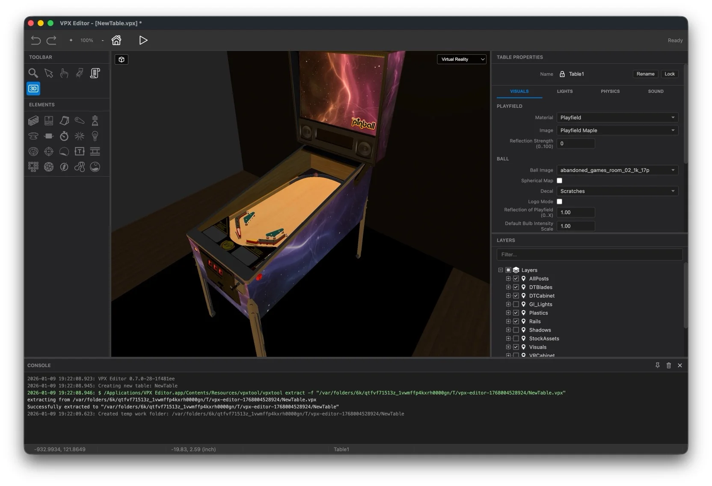
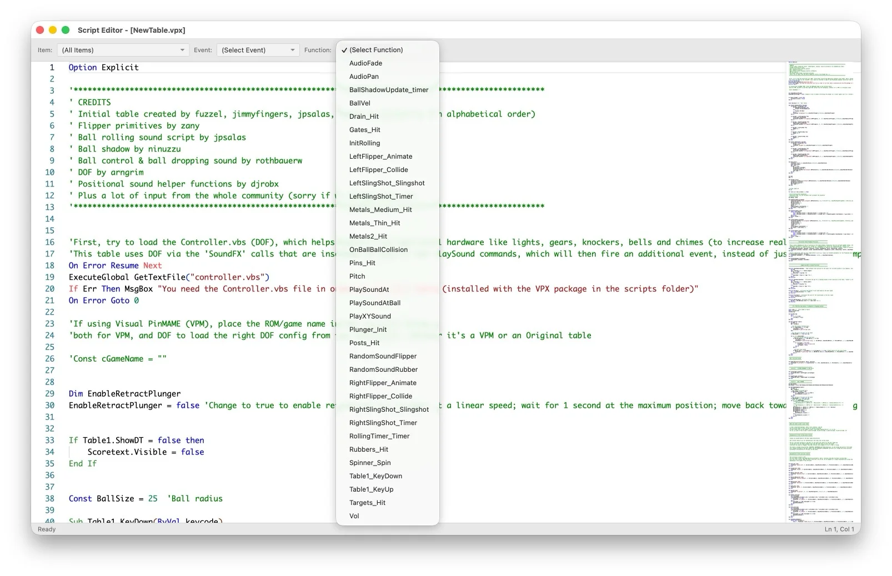
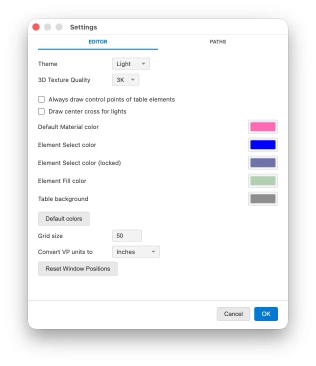
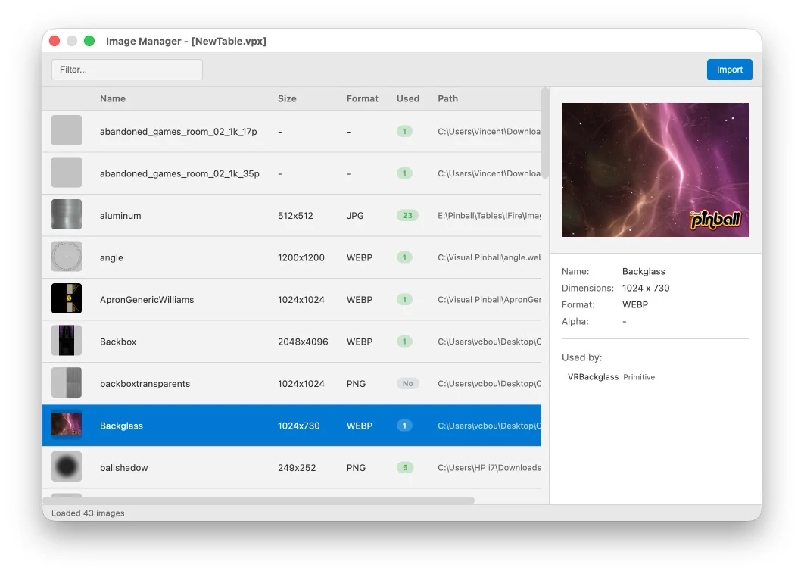

# VPX Editor

A cross-platform editor for Visual Pinball X (.vpx) table files.

<p align="center">
  
</p>
<p align="center">
  
</p>
<p align="center">
  
</p>
<p align="center">
  
</p>
<p align="center">
  
</p>
<p align="center">
  
</p>

## Overview

VPX Editor is a cross-platform table editor for [Visual Pinball](https://github.com/vpinball/vpinball), built with [Electron](https://www.electronjs.org/), [TypeScript](https://www.typescriptlang.org/), and [Three.js](https://threejs.org/). It uses [vpxtool](https://github.com/francisdb/vpxtool) to extract and assemble VPX files.

This project was initially created with the assistance of Claude AI.

> [!WARNING]
> **Always make a backup of your VPX files before editing!** This editor is in early development and is bound to have bugs.

> [!NOTE]
> This editor converts tables to use **Part Groups** instead of Layers, a new feature introduced in VPX 10.8.1. Tables saved with this editor require **VPinball 10.8.1 or later** to run.

## Features

### 2D Editor
Port of the Windows VPX 2D editor:
- All playfield elements (walls, ramps, flippers, bumpers, lights, etc.)
- Drag-and-drop object placement
- Multi-select and transform operations

### Managers
- Sound Manager
- Image Manager
- Material Manager
- Dimension Manager
- Collection Manager
- Render Probe Manager

### Script Editor
- Monaco-based VBScript editor
- Syntax highlighting
- Function creation

### 3D Preview
- Real-time 3D rendering with Three.js
- Blender-style controls
- Material and texture preview
- Wireframe mode
- Play Mode preview (Desktop, FSS, Cabinet, Mixed Reality, VR)

### Quick Play
- Configure VPinball executable path in settings
- Launch and test tables directly from the editor

### Themes
- Light and dark mode
- System theme detection

## 3D Controls

Blender-style navigation:

| Input | Action |
|-------|--------|
| Middle-drag | Orbit camera |
| Shift + Middle-drag | Pan camera |
| Scroll wheel | Zoom |
| Numpad 1 | Front view |
| Numpad 3 | Side view |
| Numpad 7 | Top view |
| Ctrl + Numpad | Opposite views |
| Alt (hold) | Temporary orbit mode |

## Installation

Download the latest release for your platform from the [Releases](https://github.com/vpinball/vpx-editor/releases) page.

- **VPinball 10.8.1+** - Required only for playing tables from the editor

## Development

### Requirements

- **Node.js** 20+

### Getting Started

```bash
npm install
```

### Run Locally

```bash
npm start
```

Launches the app in development mode with hot reload.

### Build Release

```bash
npm run make
```

Creates distributable packages for the current platform:

| Platform | Format | Architecture |
|----------|--------|--------------|
| macOS | DMG, ZIP | arm64 |
| Linux | DEB, RPM, Flatpak, ZIP | x64 |
| Windows | Squirrel Installer, ZIP | x64 |

#### Flatpak issues

If you have issues building the flatpak try this first:

```bash
flatpak --user remote-add --if-not-exists flathub https://dl.flathub.org/repo/flathub.flatpakrepo
```

To get more output during the flatpak build:

```bash
DEBUG=electron-installer-flatpak,@malept/flatpak-bundler npm run make
```

### Type Checking

```bash
npm run typecheck
```

### Code Formatting

```bash
npm run format
```

## Architecture

```
src/
├── main/
│   ├── menu/
│   ├── settings/
│   └── vpx/
├── preload/
├── editor/
│   ├── components/
│   ├── meshes/
│   ├── parts/
│   └── undo/
├── types/
└── windows/
    ├── dialogs/
    ├── managers/
    ├── script-editor/
    ├── search-select/
    └── settings/
```

## Acknowledgments

- [Visual Pinball](https://github.com/vpinball/vpinball)
- [vpxtool](https://github.com/francisdb/vpxtool)
- [Three.js](https://threejs.org/)
- [Monaco Editor](https://microsoft.github.io/monaco-editor/)

## License

This project is licensed under the GNU General Public License v3.0 or later - see the [LICENSE](LICENSE) file for details.

This matches the license used by [Visual Pinball](https://github.com/vpinball/vpinball).
